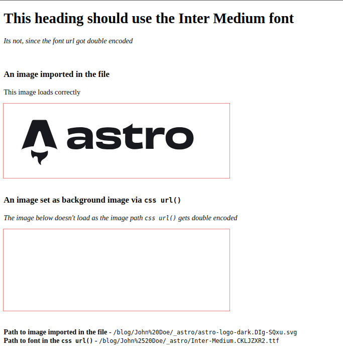

## In css url() references, output paths for assets are double encoded.

I've set `base` = `/blog/John%20Doe` in the astro config.

When building and deploying the site, the final path to the assets in css `url()` references are _double encoded_.

The output paths in css url() becomes `/blog/John%2520Doe/...`, when they should stay `/blog/John%20Doe/...`

The background image url becomes

> /blog/**John%2520Doe**/\_astro/astro-logo-dark.[hash].svg

The font url becomes

> /blog/**John%2520Doe**/\_astro/Inter-Medium.[hash].ttf

<br />

The `%` in `config.base` has been encoded to `%25`

_The problem persists when `base` is not URL encoded (base = `/blog/John Doe`)_

<br />

### Steps to reproduce

- Clone this repository
- Build the astro site and preview it (`astro build && astro preview`)
- View the generated paths for the svg and the font file

<br />

### Build output



#### Notice the css url() paths to the assets on building the site.

```html
<!DOCTYPE html>
<html lang="en">

<head>
    <meta charset="UTF-8">
    <meta name="viewport" content="width=device-width">
    <title>Double encoding</title>
    <style>
        @font-face {
            font-family: Jersey;
            src: url(/blog/John%2520Doe/_astro/Inter-Medium.CKLJZXR2.ttf) format("truetype");
            font-weight: 400;
            font-style: normal;
            font-display: auto
        }

        h1 {
            font-family: Jersey
        }

        .background-img {
            background: url(/blog/John%2520Doe/_astro/astro-logo-dark.DIg-SQxu.svg) no-repeat top left;
            height: 100%
        }

        .inner {
            width: 200px;
            height: 180px
        }

        section {
            outline: 2px solid lightcoral;
            max-width: 500px
        }
    </style>
</head>

<body>
    <main>
        <h1>This heading should use the Inter Medium font</h1>
        <p><i>Its not, since the font url got double encoded</i></p> <br>
        <h3>An image imported in the file</h3>
        <p>This image loads correctly</p>
        <section></section> <br>
        <h3>An image set as background image via <code>css url()</code></h3>
        <p> <i>
                The image below doesn't load as the image path
                <code>css url()</code>
                gets double encoded
            </i> </p>
        <section class="background-img">
            <div class="inner"></div>
        </section> <br> <br>
        <div> <span> <strong>Path to image imported in the file - </strong>
                <code>/blog/John%20Doe/_astro/astro-logo-dark.DIg-SQxu.svg</code> </span> </div>
        <div> <span> <strong>Path to font in the <code>css url()</code> - </strong>
                <code>/blog/John%2520Doe/_astro/Inter-Medium.CKLJZXR2.ttf</code> </span> </div>
    </main>
</body>

</html>
```
